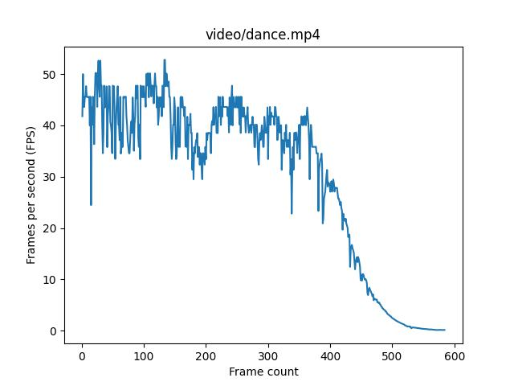
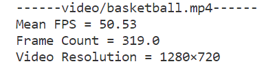
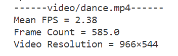

# Video-Tracking-Correlation-Filters
 Object Tracking in Video based on Correlation Filters

 

## Algorithm Flowchart

<h3 align="center">Fig. 1: Algorithm Flowchart of Visual Object Tracking based on Correlation Filters</h3>

 

## Result

|  Instance  |            Video Tracking            | Mean FPS |
| :--------: | :----------------------------------: | :------: |
| Basketball |  |  50.02   |
|  Balloon   |        |  49.23   |
|   Dance    |            |  37.55   |

 

####   Basketball - Mean FPS: 50.02

|  |  |
| ---------------------------- | ---------------------------- |
|  |  |

 

####   Balloon - Mean FPS: 49.23

|  |   |
| ------------------------------- | ------------------------------- |
|  |  |

 

####   Dance - Mean FPS: 37.55

|   |   |
| --------------------------- | ---------------------------- |
|  |   |

 

##   Graph Plotting
####   Intensity

| 特征类型 | 篮球赛视频                                | 热气球飞行视频                          | 舞蹈视频                             |
| :--------: | :-----------------------------------------: | :---------------------------------------: | :-----------------------------------: |
| 密度     |  |  |  |
| Hog      |        |         |        |
| 梯度     |   |    |   |

 

| 特征类型    | 篮球赛视频                                                   | 热气球飞行视频                                               | 舞蹈视频                                                     |
| :---------: | :------------------------------------------------------------: | :------------------------------------------------------------: | :------------------------------------------------------------: |
| Intensity |  |  |  |
| Hog       |  |  |  |
| Gradient |                                                              |  |                                                              |

 

#### 

